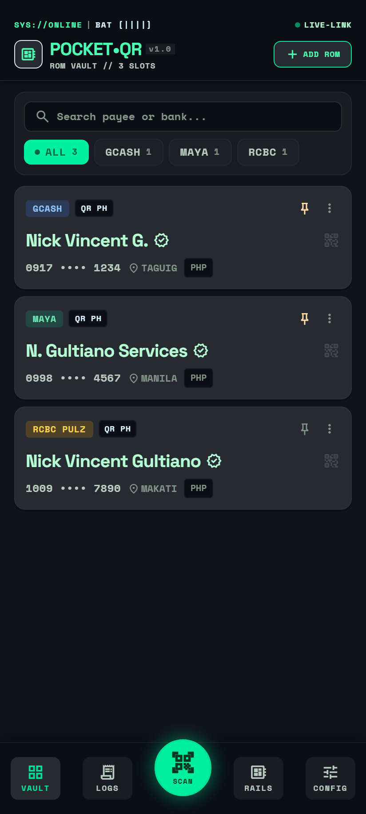
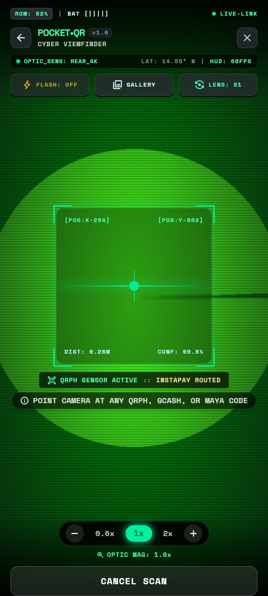
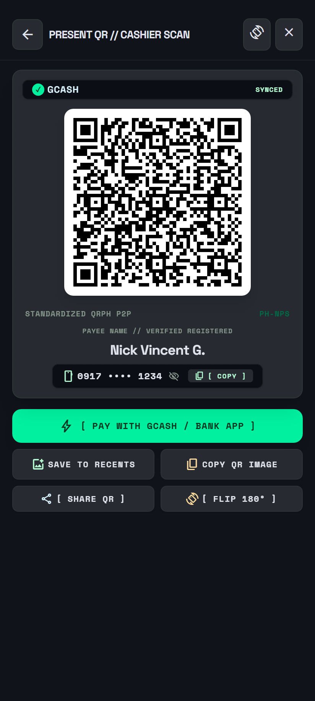
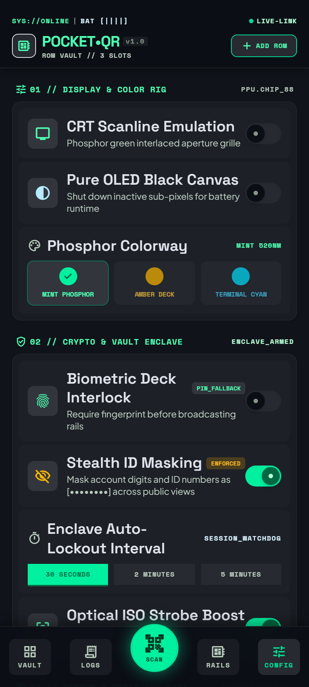
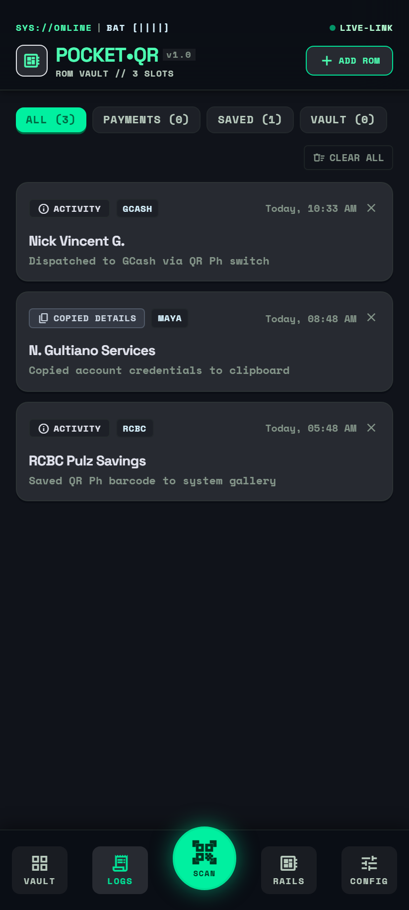

# ⚡ PocketQR

<div align="center">

**Tactical Offline QR Ph Payment Card Wallet & Scanner for Android**  
*Pure local data sovereignty, instant bank app dispatch, dual-engine zoom, and retro-cyberdeck aesthetics.*

[](https://github.com/nickob4by/PocketQR/releases/latest)
[](https://github.com/nickob4by/PocketQR/releases/latest)
[](https://github.com/nickob4by/PocketQR)
[](LICENSE)

<br/>

<a href="https://github.com/nickob4by/PocketQR/releases/latest/download/PocketQR.apk">
  
</a>

<p align="center">
  <a href="#-visual-showcase">Visual Showcase</a> •
  <a href="#-key-features">Key Features</a> •
  <a href="#-supported-philippine-banks--wallets">Supported Banks</a> •
  <a href="#-architecture--tech-stack">Architecture</a> •
  <a href="#-installation--sideloading">Installation</a> •
  <a href="#-development--build">Development</a>
</p>

</div>

---

## 📸 Visual Showcase

<div align="center">
<table>
  <tr>
    <td align="center" width="33%">
      <b>🗂️ Tactical ROM Vault</b><br/>
      
      <br/>
      <sub>Bank filter pills, favorite pins, search bar, and masked ID numbers.</sub>
    </td>
    <td align="center" width="33%">
      <b>🎯 Cyber Viewfinder & Zoom</b><br/>
      
      <br/>
      <sub>Edge-to-edge camera, CRT aperture, 0.6x/1x/2x zoom deck & telemetry.</sub>
    </td>
    <td align="center" width="33%">
      <b>⚡ Cashier Scan & Flip</b><br/>
      
      <br/>
      <sub>Standardized QR Ph matrix, 180° rotation, tactile copy, and reveal toggle.</sub>
    </td>
  </tr>
  <tr>
    <td align="center" width="33%">
      <b>🎨 Display & Color Rig</b><br/>
      
      <br/>
      <sub>Phosphor colorways (Mint, Amber, Cyan), OLED pure black & Stealth ID toggle.</sub>
    </td>
    <td align="center" width="33%">
      <b>📜 Activity & Dispatch Ledger</b><br/>
      
      <br/>
      <sub>Local cryptographic audit log tracking payment dispatches and gallery exports.</sub>
    </td>
    <td align="center" width="33%">
      <b>🛡️ Zero Cloud / 100% Offline</b><br/>
      <div style="padding: 24px 12px;">
        <h3>🔒 Sovereign Hardware Wallet</h3>
        <p>No backend servers.<br/>No user analytics.<br/>No cloud synchronization.<br/>All keys and payment cards stay encrypted on your device.</p>
      </div>
    </td>
  </tr>
</table>
</div>

---

## ✨ Key Features

### 🎯 Dual-Engine Cyber Zoom Adjuster
- **0.6x Wide-Angle FOV**: Uncropped sensor view eliminates the "too zoomed in" camera problem on tall smartphone displays (19.5:9 / 20:9), allowing you to frame counter QR codes up close without stepping back.
- **Micro-Steppers & Presets**: Tap `0.6x`, `1x`, or `2x` for instant magnification, or use `[-]` / `[+]` for `0.2x` micro-stepping.
- **Pinch-to-Zoom**: Fluid two-finger pinch gesture supported across the entire viewfinder.
- **Hardware Optical + Fallback**: Uses hardware `MediaStreamTrack.applyConstraints({ zoom })` when supported by device cameras, with smooth hardware-accelerated CSS scaling fallback.

### 🛡️ Stealth ID Masking (Privacy-First)
- **Shoulder-Surfing Defense**: Automatically masks phone numbers (`0917 •••• 1234`) and bank account/ID codes (`ID: ••••XIB3FS`) across Vault cards and presentation modals.
- **One-Tap Peek Eye**: Tap the eye icon to temporarily reveal digits when verifying details.
- **Tactile Clipboard Copy**: One tap copies the full, unmasked account number for pasting into banking apps.

### 🎨 Dynamic Scan Glow & Phosphor Colorways
- **Theme-Adaptive Scan Glow**: The elevated circular Scan-to-Pay button dynamically projects a glowing ambient aura matching your selected colorway in real time.
- **Three Fixed Phosphor Wavelengths**:
  - **MINT PHOSPHOR (520nm)**: Signature cyberpunk green.
  - **AMBER DECK (590nm)**: Warm, high-contrast monochrome CRT terminal.
  - **TERMINAL CYAN (470nm)**: Electric blue retro sci-fi deck.
- **CRT Scanline Emulation**: Optional interlaced aperture grille overlay for vintage tactile nostalgia.
- **Pure OLED Black Canvas**: Shuts off inactive OLED subpixels to preserve battery runtime during transactions.

### 🔍 Smart Duplicate QR Detection
- **Dual-Layer Heuristics**: Prevents accidentally saving the same card twice.
  - **Exact EMVCo Payload Match**: Detects identical QR Ph data strings even if screenshot images differ.
  - **Normalized Account Matching**: Normalizes Philippine mobile formats (`+63`, `63`, `09`) and strips dashes/spaces to identify identical account numbers across the same provider.

### ⚡ Direct Banking App Handoff
- **Zero Browser Sandboxing**: Bypasses slow mobile web browsers and redirects directly to official installed Philippine banking apps via native Android `Intent` and `PackageManager` detection.
- **Splash Freeze Prevention**: Dispatches apps via canonical package launcher intents (`FLAG_ACTIVITY_NEW_TASK | FLAG_ACTIVITY_RESET_TASK_IF_NEEDED`), ensuring apps like RCBC Pulz, Maya, and GCash open directly to their authentication/biometric screen without hanging on empty deep link routers.
- **System Chooser Integration**: Automatically detects which payment apps are installed on your device (GCash, Maya, RCBC Pulz, BPI, etc.) and routes with one tap.

---

## 🏦 Supported Philippine Banks & Wallets

PocketQR recognizes, auto-parses, and routes standardized **QR Ph (National QR Code Standard)** payloads:

| Provider | Type | Rail | Direct App Dispatch |
|---|---|---|:---:|
| **GCash** | E-Wallet | InstaPay / P2P | ✅ |
| **Maya (PayMaya)** | E-Wallet / Bank | InstaPay / P2P | ✅ |
| **RCBC Pulz** | Commercial Bank | InstaPay / PesoNet | ✅ |
| **BPI (Bank of the Philippine Islands)** | Commercial Bank | InstaPay / QR Ph | ✅ |
| **UnionBank of the Philippines** | Commercial Bank | InstaPay | ✅ |
| **BDO Unibank** | Commercial Bank | InstaPay | ✅ |
| **LandBank of the Philippines** | Government Bank | InstaPay | ✅ |
| **GoTyme Bank** | Digital Bank | InstaPay | ✅ |
| **Seabank Philippines** | Digital Bank | InstaPay | ✅ |
| **Other QR Ph Merchants** | Standard EMVCo | Merchant / P2M | ✅ |

---

## 🏛️ Architecture & Tech Stack

```
PocketQR/
├── src/
│   ├── components/         # Stitch Cyberdeck UI Components
│   │   ├── BottomNav.tsx   # Elevated scan button with dynamic colorway glow
│   │   ├── ConfigView.tsx  # Display rig, CRT toggles, and Phosphor Colorways
│   │   ├── PresentationModal.tsx # High-contrast QR display with 180° rotation
│   │   ├── QRCard.tsx      # Tactile cartridge cards with Stealth ID Masking
│   │   └── ScanToPayModal.tsx    # Live camera viewfinder with Cyber Zoom Adjuster
│   ├── lib/
│   │   ├── emvcoParser.ts  # EMVCo / QR Ph tag and sub-tag parser
│   │   ├── cardUtils.ts    # Duplicate detection & account normalization
│   │   ├── deepLink.ts     # Android package routing & Intent chooser
│   │   └── storage.ts      # Offline encrypted IndexedDB repository
│   └── types/              # TypeScript interface definitions
├── android/                # Capacitor Android native project & Gradle build
└── docs/screenshots/       # High-resolution mobile snapshots
```

- **Frontend Core**: [React 19](https://react.dev/), [TypeScript](https://www.typescriptlang.org/), [Vite 8](https://vite.dev/)
- **Mobile Engine**: [Capacitor 8](https://capacitorjs.com/) (Android Bridge, Camera2, Haptics, App Launcher)
- **Styling**: [Tailwind CSS](https://tailwindcss.com/) with Google Stitch Cyberdeck design tokens
- **QR Engine**: [qrcode.react](https://github.com/zpao/qrcode.react), [@zxing/library](https://github.com/zxing-js/library)
- **Local Persistence**: [idb](https://github.com/jakearchibald/idb) (IndexedDB wrapper)
- **Linter**: [Oxlint](https://oxc.rs/)

---

## 📲 Installation & Sideloading

### Android Sideloading (Recommended)
1. Download the latest APK: **[PocketQR.apk (v1.0.30)](https://github.com/nickob4by/PocketQR/releases/latest/download/PocketQR.apk)**.
2. On your Android device, open the downloaded file from **Downloads** or your notification shade.
3. If prompted, toggle **"Allow from this source"** in Android Settings.
4. Tap **Install** and launch PocketQR!

### Progressive Web App (PWA)
1. Navigate to the deployed instance in Google Chrome or Microsoft Edge.
2. Tap the browser menu `⋮` and select **"Add to Home Screen"** or **"Install App"**.

---

## 💻 Development & Build

### Prerequisites
- **Node.js**: v22+
- **npm**: v10+
- **Android Studio & SDK**: API 34+ (for Android APK compilation)
- **Java**: JDK 21

### Local Setup
```bash
# Clone the repository
git clone https://github.com/nickob4by/PocketQR.git
cd PocketQR

# Install dependencies
npm install

# Start Vite local development server
npm run dev
```

### Building the Android APK
```bash
# Compile web assets and sync to native Android container
npm run build
npx cap sync android

# Build debug APK locally
cd android
./gradlew assembleDebug

# Output APK location:
# android/app/build/outputs/apk/debug/app-debug.apk
```

### Regenerating Repository Screenshots
To automatically take pixel-perfect, high-resolution mobile snapshots of all app views:
```bash
npm run screenshots
```

---

## 🔒 Security & Privacy Policy

- **Zero Network Ingestion**: PocketQR never transmits payment credentials, account numbers, or scanned barcodes to any external server.
- **Local Storage Enclave**: All cards and activity logs reside strictly within your device's sandboxed IndexedDB storage.
- **Biometric Authentication**: Supports native Android Fingerprint / Face Unlock to gate access before presenting cards.

---

## 📄 License

Distributed under the **MIT License**. See [`LICENSE`](LICENSE) for more information.

<div align="center">
  <sub>Engineered with precision for Philippine cashless commerce • Built by Nick Vincent Gultiano</sub>
</div>
